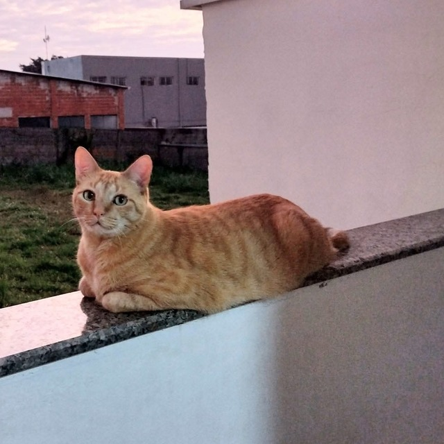
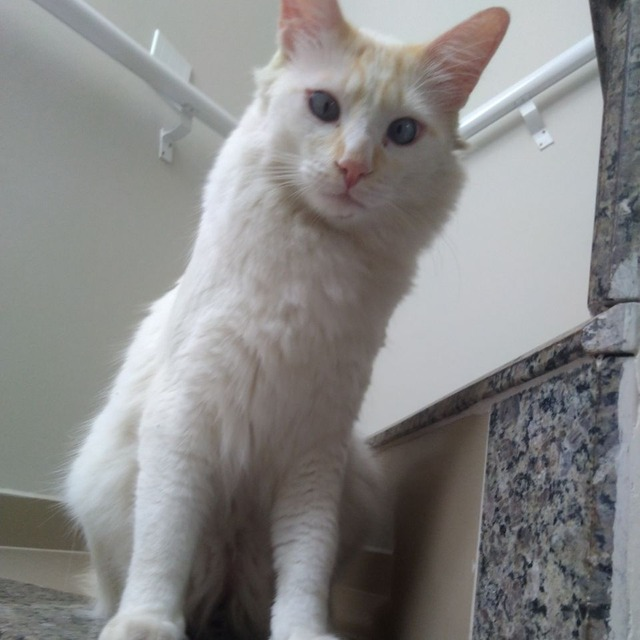
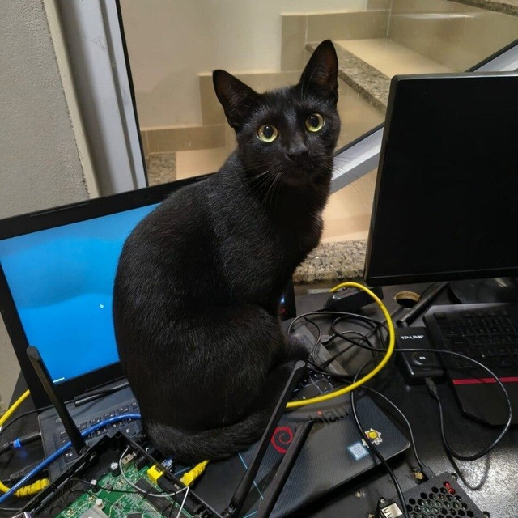

## Engineering Team

<table>
<tr>
<th>Kyou</th>
<th>Freud</th>
<th>Bituca</th>
</tr>
<tr>
<td align="center"></td>
<td align="center"></td>
<td align="center"></td>
</tr>
<tr>
<td align="center"><strong>Orange Engineer</strong></td>
<td align="center"><strong>Loudness Engineer</strong></td>
<td align="center"><strong>Thermal QA Engineer</strong></td>
</tr>
<tr>
<td valign="top">Loves sitting on my lap while I code.</td>
<td valign="top">Maintains the household dB budget.</td>
<td valign="top">Validates bench thermals by occupying the warmest hardware available.</td>
</tr>
</table>

## PGP

`C68D 2507 26D8 4D8B DC82  854B 98E1 C4D0 10FE 35BA` · [Public key](adriel-pubkey.asc)

## Donations

*Straight to coffee, cat food and tokens.*

<table>
<tr>
<th>Asset</th>
<th>Address</th>
</tr>
<tr>
<td><strong>PIX (BRL)</strong></td>
<td>

<code>dfbaa96c-b191-4619-b539-b7877e892a63</code>
</td>
</tr>
<tr>
<td><strong>Bitcoin (BTC)</strong> Taproot · Mainnet</td>
<td><code>bc1p5kc8ehauhuzj6e2qgm6mp6tw5vjahkxz4yk33urjh5xzpul0ujvswxpuwf</code></td>
</tr>
<tr>
<td><strong>Bitcoin (BTC)</strong> Native SegWit · Mainnet</td>
<td><code>bc1que4n5vqq5t7d5layssfu5anfr5ssxlcamxzm2u</code></td>
</tr>
<tr>
<td><strong>Ethereum (ETH)</strong> Mainnet</td>
<td><code>0x9A646688A84fAA19b51b2a0C0375BC5Df851b143</code></td>
</tr>
<tr>
<td><strong>Solana (SOL)</strong> Mainnet</td>
<td><code>E8p27SoxyNCuv8UVf7moVteShHNK6b1VZbHuFDK8TbK6</code></td>
</tr>
</table>
